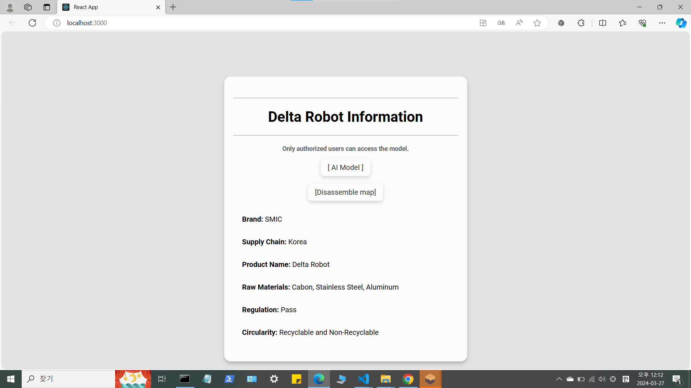

# Ethereum Blockchain-Based Digital Product Passport

This project implements a **Digital Product Passport** based on the **Ethereum blockchain**. It provides transparent product information management and enables a traceable digital history.

<br><br>

## 📋 Prerequisites

- **Node Package Manager (npm)**  
  A package manager bundled with Node.js, which installs and manages project dependencies.  
  **Installation**: Download from [npm official site](https://www.npmjs.com/get-npm).

- **React**  
  A JavaScript library for user interfaces. It is used to create the UI for interacting with the blockchain on the frontend.  
  **Installation**: 
  ```bash
  npx create-react-app my-app
  ```

- **Ganache**  
  A tool that provides a local Ethereum blockchain for testing. It is used to deploy and test smart contracts.  
  **Installation**: Download from [Ganache official site](https://trufflesuite.com/ganache/).

- **Truffle**  
  An Ethereum development framework that assists in developing and deploying smart contracts.  
  **Installation**: 
  ```bash
  npm install -g truffle
  ```

- **MetaMask**  
  A wallet extension that can be installed in the browser to interact with the blockchain network.  
  **Installation**: Available as a browser extension from the [MetaMask website](https://metamask.io/).

- **Solidity**  
  A programming language used for writing Ethereum smart contracts. The Solidity compiler is required.  
  **Installation**: 
  ```bash
  npm install -g solc
  ```

- **web3.js**  
  A JavaScript library for interacting with the Ethereum blockchain.  
  **Installation**: 
  ```bash
  npm install web3
  ```

After installing each item, verify that it is working correctly before proceeding to run the project.

<br><br>

## 📂 Directory Structure

- **build, contracts, migrations folders, and truffle-config.js file**  
  These folders and file are essential for deploying the smart contract.
  - The `build` folder contains files generated after compiling the smart contract.
  - The `contracts` folder contains Solidity files, where the smart contract code is written.
  - The `migrations` folder holds configuration files used to deploy the smart contract to the blockchain.
  - The `truffle-config.js` file defines Truffle's environment settings, where network configurations for deployment and testing are specified.

- **Other folders and files**  
  The rest of the files and folders make up the **React-based app source** for the web application that uses web3.js to connect the smart contract with the user interface. These allow users to view blockchain data in a web format.

<br><br>

## 🔑 Key Files

- **truffle-config.js**  
  The main configuration file for Truffle, defining settings for testing and deploying smart contracts in a local blockchain environment. It specifies the address and port of local development environments like **Ganache**.  
  **More information**: [Truffle Configuration Guide](https://trufflesuite.com/docs/truffle/reference/configuration)

- **migrations/2_deploy_contracts.js**  
  This file is used to deploy the smart contract to the blockchain. It manages the Solidity files to be deployed and deployment settings, utilizing Truffle's migration feature to deploy multiple smart contracts sequentially.  
  **Additional Note**: Truffle's migration scripts record deployment history to avoid redundant deployments, making contract management efficient.

- **contracts/Contacts.sol**  
  The smart contract code file written in Solidity. It defines the data structures and functions related to the digital history of the product.  
  **Solidity Official Documentation**: [Solidity Documentation](https://docs.soliditylang.org/)

- **src/config.js**  
  Stores the address and ABI (Application Binary Interface) of the deployed smart contract, enabling web3.js to interact with it.  
  **More Information**: The ABI is a JSON representation of the functions and data in the smart contract, allowing web3.js to call its methods.

- **src/App.js**  
  Displays smart contract data on the web application in a **DPP** (Digital Product Passport) format using React and web3.js. App.js defines the overall app structure and logic for interacting with the smart contract.

- **src/App.css**  
  A stylesheet file linked to App.js, defining the design of the web application. It manages styling for a user-friendly presentation of data and the layout of the page.

<br><br>

## 🚀 Running and Usage

### 1. Create a Virtual Ethereum Network Environment

- Use **Ganache** to create a local virtual network. This provides an Ethereum blockchain environment for development and testing purposes.
  - **Ganache Download**: [Ganache official site](https://trufflesuite.com/ganache/)

### 2. Connect Browser to Virtual Network

- Install **MetaMask** to connect the browser to the Ganache virtual network. MetaMask acts as a personal wallet for interacting with the virtual network.
  - **MetaMask Installation**: [MetaMask website](https://metamask.io/)

### 3. Set Up Deployment Environment

- Use **Truffle** to configure the deployment environment. Specify the Ganache network's address and port in the `truffle-config.js` file to enable Truffle to connect to the virtual network.

### 4. Prepare Smart Contract Files

- Place the **Solidity smart contract files** to be deployed in the `contracts` folder and call the smart contract in the deployment script in the `migrations` folder.

### 5. Deploy Smart Contract

- Use Truffle's migration feature to deploy the smart contract.
  ```bash
  truffle migrate --network development
  ```

### 6. Install React Libraries

- Install the necessary React modules.
  ```bash
  npm install
  ```

### 7. Start the React App

- Run the React application to view smart contract data on the web.
  ```bash
  npm start
  ```

<br><br>

## 🌟 Screenshots and Features

### Web Application Features

This project provides **DPP (Digital Product Passport)** as a web application that transparently presents data stored in the smart contract. The main features include:

1. **Product Information Lookup**: DPP displays the digital history of a product, providing users with traceable information about a specific product.
2. **Smart Contract Interaction**: Integrates with MetaMask, allowing users to easily access and interact with data within the contract.
3. **Data Visualization**: Utilizes web3.js to present blockchain data in a user-friendly format.

### 📸 Screenshot

A view of the web app displaying data from the smart contract:


